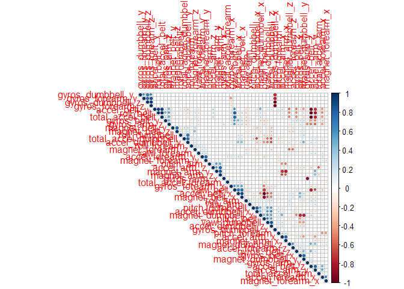
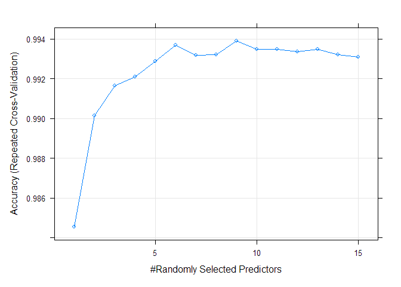
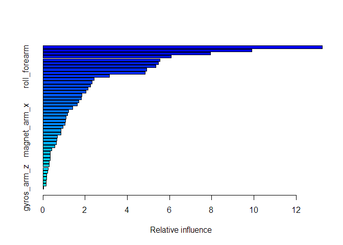

## Introduction

Using devices such as Jawbone Up, Nike FuelBand, and Fitbit it is now
possible to collect a large amount of data about personal activity
relatively inexpensively. These type of devices are part of the
quantified self movement -- a group of enthusiasts who take measurements
about themselves regularly to improve their health, to find patterns in
their behavior, or because they are tech geeks. One thing that people
regularly do is quantify how much of a particular activity they do, but
they rarely quantify how well they do it. In this project, your goal
will be to use data from accelerometers on the belt, forearm, arm, and
dumbell of 6 participants. They were asked to perform barbell lifts
correctly and incorrectly in 5 different ways. More information is
available from the website here:
<http://groupware.les.inf.puc-rio.br/har> (see the section on the Weight
Lifting Exercise Dataset).

The goal of your project is to predict the manner in which they did the
exercise. This is the "classe" variable in the training set. You may use
any of the other variables to predict with. You should create a report
describing how you built your model, how you used cross validation, what
you think the expected out of sample error is, and why you made the
choices you did. You will also use your prediction model to predict 20
different test cases.

NOTE: At the time of this submission, the groupware site referenced
above is inaccessible. Therefore, we are limited to the information
available in the data files to understand the data.

NOTE TO REVIEWERS: Some of the prediction methods used are computational expensive. To cut down on computation time and still allow for model tuning, parallel processing is enabled. For more information on using parallel processing for this project and the impacts, refer to https://github.com/lgreski/datasciencectacontent/blob/master/markdown/pml-randomForestPerformance.md. 

```r
# Setup parallel processing
library(parallel)
library(doParallel)
cluster <- makeCluster(detectCores() - 1) # convention to leave 1 core for OS
registerDoParallel(cluster)

set.seed(123)
```

## Loading and Exploring Data

Download the data from online storage and load it into training and
testing data sets.


```r
destFolder = "./data"

if(!file.exists(destFolder)) {dir.create(destFolder)}

fileUrl <- "https:/d396qusza40orc.cloudfront.net/predmachlearn/pml-training.csv"
destFile = "./data/pml-training.csv"
if(!file.exists(destFile)) {
    download.file(fileUrl, destfile = destFile, method = "curl")
}

dataTraining <- read.csv(destFile)

fileUrl <- "https:/d396qusza40orc.cloudfront.net/predmachlearn/pml-testing.csv"
destFile = "./data/pml-testing.csv"
if(!file.exists(destFile)) {
    download.file(fileUrl, destfile = destFile, method = "curl")
}

dataTesting <- read.csv(destFile)
```
  
Split the dataTraining data set into a training and validation sets. 


```r
inTrain <- createDataPartition(y = dataTraining$classe,
                               p = 0.7,
                               list = FALSE)
dataTraining$classe <- as.factor(dataTraining$classe)
training <- dataTraining[inTrain,]; validation <- dataTraining[-inTrain,]
```
  
There are 160 variables in the training data set, however, some of the variables are almost entirely devoid of information due to blanks, NAs, or division by zero errors.  

```r
bad_count <-sapply(training, function(x) sum(is.na(x) | x == "" | x == "#DIV/0!"))
numWithBad <- sum(bad_count==0)
```
  
60 columns have at least one of these problem entries. Just to be sure, only the variables with more than 70% valid data will be kept.  (NOTE: determine the columns to remove by looking at the training data only but apply it to both training and validation data sets).  
  

```r
dimStart <- dim(training)[2]
few_bad <- bad_count <= 0.7*length(training$classe)
training <- training[,few_bad]
validation <- validation[,few_bad]
dimBad <- dim(training)[2]
```

```r
# Keep track of the columns removed so we can apply the same the testing data set
colRemoved <- bad_count > 0.7*length(training$classe)
```
  
This reduced the variables from 160 to 60.  

We can also remove some of the variables that we don't want to use to predict the
outcome. These include user related variables and timestamps (the selection must be user agnostic and this isn't time series data).  As illustrated below, the new_window variable has very little variation so it can be removed from modeling, too. 

```r
table(training$new_window)
```

```
## 
##    no   yes 
## 13463   274
```

```r
unneeded <- c(1, 2, 3, 4, 5, 6)
training <- training[,-unneeded]
validation <- validation[,-unneeded]

colRemoved <- c(unneeded, colRemoved)
```
  
Correlation between variables can cause many of our models to perform poorly. Plot the correlation matrix to see if we have any highly correlated predictors. 

```r
corr <- cor(training[,-54])
corrplot(corr, type="upper", order="hclust", 
         sig.level = 0.01, insig = "blank")
```

<!-- -->
  
A large number of variables have a low correlation. However, there are a few highly correlated variables. Find those variables with a high level of correlation to other variables in the data set and remove them. A cutoff of 0.9 will only remove those with the most extreme correlation. 

```r
dimb4Corr <- dim(training)
removeCorr <- findCorrelation(corr, cutoff = 0.9)
print("Indices of highly correlated variables to remove")
```

```
## [1] "Indices of highly correlated variables to remove"
```

```r
removeCorr
```

```
## [1] 11  2 10  9 32 34 19
```

```r
training <- training[,-removeCorr]
validation <- validation[,-removeCorr]

colRemoved <- c(removeCorr, colRemoved)
dimAfterCorr <- dim(training)
```
  
This removes another 0, 7 variables, leaving a final data set of 1.3736\times 10^{4}, 46 variables we will use to predict the variable 'classe'.  

# Modeling
The general approach is to individually evaluate several unrelated modeling methods and then combine their results using model stacking. The 'classe' variable is a factor with 5 possible values, therefore, we will select prediction models appropriate for classification problems. Random Forest and Generalized Boosting models, both tree-based models, are used along with Linear Discrete Analysis and Naive Bayes, both model-based methods. There are many, many modeling options so this is only a small sample of options.   

## Random Forest
Random Forest is an extension of bagging for classification and regression trees. It should prove highly accurate but is computationally intensive and susceptible to overfitting. For that reason, we will tune the algorithm to avoid overfitting and improve performance.  

The total number of trees is reduced to 150 from the default 500. The model is then trained using values of mtry ranging from 1 to 15. (refer to https://rpubs.com/phamdinhkhanh/389752 for this and other tuning methods.)

```r
mbmRFtune <- system.time({

  RFControl <- trainControl(method='repeatedcv',
                          number=10,
                          repeats=3,
                          search='grid',
                          allowParallel = TRUE)
  # Run with various different values of mtry from 1 to 15
  tunegrid <- expand.grid(.mtry = (1:15))
  modRF <- train(classe ~., data=training,
                 method="rf",
                 ntree = 150,
                 trControl = RFControl,
                 metric = 'Accuracy',
                 tuneGrid = tunegrid,
                 verbose="FALSE")
})
```

```r
plot(modRF)
```

<!-- -->
  
The model accuracy increases as mtry increases, however, after mtry=4 the marginal improvement in accuracy drops off significantly. Selecting mtry=4 will continue to provide high accuracy while reducing execution time and reducing the likelihood of over fitting.


```r
mbmRF <- system.time({

RFControl <- trainControl(method='repeatedcv',
                        number=10,
                        repeats=3,
                        search='grid',
                        allowParallel = TRUE)
# Run with mtry=8
tunegrid <- expand.grid(.mtry = 4)
modRF <- train(classe ~., data=training,
               method="rf",
               ntree = 150,
               trControl = RFControl,
               metric = 'Accuracy',
               tuneGrid = tunegrid,
               verbose="FALSE")
})
```
  
The final random forest model achieves a high accuracy of 0.9961659 on the training data set.  

## Stochastic Gradient Boosting Tree Model
The GBM algorithm will assemble a prediction tree while boosting weak performing predictors at each level to force better fits. Like Random Forest model, GBM models are prone to over fitting. To minimize this problem, run an autotuning version using repeated cross validation in caret. (for more information on tuning GBM, refer to https://towardsdatascience.com/understanding-gradient-boosting-machines-9be756fe76ab and  https://www.listendata.com/2015/07/gbm-boosted-models-tuning-parameters.html)  

```r
mbmBoost <- system.time({

  BoostControl <- trainControl(## 10-fold CV
      method = "repeatedcv",
      number = 10,
      ## repeated ten times
      repeats = 10,
      allowParallel = TRUE)
  modBoost <- train(classe ~., data=training, method="gbm", 
                    trControl = BoostControl, 
                    verbose="FALSE")
})
```

```
## Iter   TrainDeviance   ValidDeviance   StepSize   Improve
##      1        1.6094             nan     0.1000    0.2245
##      2        1.4732             nan     0.1000    0.1555
##      3        1.3784             nan     0.1000    0.1171
##      4        1.3058             nan     0.1000    0.1080
##      5        1.2407             nan     0.1000    0.0782
##      6        1.1911             nan     0.1000    0.0836
##      7        1.1403             nan     0.1000    0.0718
##      8        1.0960             nan     0.1000    0.0633
##      9        1.0569             nan     0.1000    0.0613
##     10        1.0174             nan     0.1000    0.0535
##     20        0.7220             nan     0.1000    0.0301
##     40        0.4585             nan     0.1000    0.0081
##     60        0.3344             nan     0.1000    0.0067
##     80        0.2519             nan     0.1000    0.0033
##    100        0.1987             nan     0.1000    0.0038
##    120        0.1584             nan     0.1000    0.0022
##    140        0.1278             nan     0.1000    0.0009
##    150        0.1143             nan     0.1000    0.0018
```

```r
print(modBoost)
```

```
## Stochastic Gradient Boosting 
## 
## 13737 samples
##    46 predictor
##     5 classes: 'A', 'B', 'C', 'D', 'E' 
## 
## No pre-processing
## Resampling: Cross-Validated (10 fold, repeated 10 times) 
## Summary of sample sizes: 12365, 12363, 12363, 12363, 12363, 12364, ... 
## Resampling results across tuning parameters:
## 
##   interaction.depth  n.trees  Accuracy   Kappa    
##   1                   50      0.7457448  0.6773588
##   1                  100      0.8257482  0.7793843
##   1                  150      0.8639809  0.8278573
##   2                   50      0.8838320  0.8528890
##   2                  100      0.9378686  0.9213766
##   2                  150      0.9631795  0.9534154
##   3                   50      0.9311055  0.9127750
##   3                  100      0.9725268  0.9652414
##   3                  150      0.9879886  0.9848067
## 
## Tuning parameter 'shrinkage' was held constant at a value of 0.1
## 
## Tuning parameter 'n.minobsinnode' was held constant at a value of 10
## Accuracy was used to select the optimal model using the largest value.
## The final values used for the model were n.trees = 150, interaction.depth =
##  3, shrinkage = 0.1 and n.minobsinnode = 10.
```
  
The optimization held shrinkage and n.minobsinnode constant and found the best model using n.trees = 150 and interaction.depth = 3. The final GBM model is also highly accurate at 0.9879886.  


```r
summary(modBoost)
```

<!-- -->

```
##                                       var      rel.inf
## num_window                     num_window 25.369277354
## yaw_belt                         yaw_belt 10.593049583
## pitch_forearm               pitch_forearm  8.343185162
## magnet_dumbbell_z       magnet_dumbbell_z  6.372130746
## magnet_belt_y               magnet_belt_y  4.237725462
## magnet_dumbbell_y       magnet_dumbbell_y  4.066385881
## gyros_belt_z                 gyros_belt_z  3.811490440
## roll_forearm                 roll_forearm  3.654443139
## pitch_belt                     pitch_belt  3.409248022
## magnet_belt_z               magnet_belt_z  3.238221745
## total_accel_belt         total_accel_belt  2.612400972
## accel_forearm_x           accel_forearm_x  2.304232241
## roll_dumbbell               roll_dumbbell  2.181046699
## accel_dumbbell_z         accel_dumbbell_z  1.883578496
## accel_dumbbell_y         accel_dumbbell_y  1.843779097
## gyros_dumbbell_y         gyros_dumbbell_y  1.643002841
## accel_forearm_z           accel_forearm_z  1.400626474
## magnet_forearm_z         magnet_forearm_z  1.391463819
## accel_dumbbell_x         accel_dumbbell_x  1.288562346
## roll_arm                         roll_arm  0.978398117
## gyros_belt_y                 gyros_belt_y  0.940546707
## yaw_arm                           yaw_arm  0.937454035
## magnet_dumbbell_x       magnet_dumbbell_x  0.916154430
## magnet_belt_x               magnet_belt_x  0.881063861
## magnet_arm_z                 magnet_arm_z  0.860465491
## gyros_arm_y                   gyros_arm_y  0.775466438
## magnet_arm_x                 magnet_arm_x  0.567333065
## gyros_belt_x                 gyros_belt_x  0.517208211
## magnet_arm_y                 magnet_arm_y  0.350246021
## total_accel_dumbbell total_accel_dumbbell  0.311327928
## pitch_dumbbell             pitch_dumbbell  0.278130761
## total_accel_arm           total_accel_arm  0.259382421
## accel_forearm_y           accel_forearm_y  0.243359015
## accel_arm_x                   accel_arm_x  0.228566374
## gyros_forearm_z           gyros_forearm_z  0.186353659
## magnet_forearm_y         magnet_forearm_y  0.184156416
## accel_arm_y                   accel_arm_y  0.172992508
## total_accel_forearm   total_accel_forearm  0.133286606
## pitch_arm                       pitch_arm  0.127471106
## magnet_forearm_x         magnet_forearm_x  0.126248898
## accel_arm_z                   accel_arm_z  0.116019378
## yaw_dumbbell                 yaw_dumbbell  0.097120849
## gyros_forearm_y           gyros_forearm_y  0.086443555
## gyros_forearm_x           gyros_forearm_x  0.063141935
## yaw_forearm                   yaw_forearm  0.010622193
## gyros_arm_z                   gyros_arm_z  0.007189502
```
   
NOTE: the GBM model allows checking which variables have the highest influence on the model. The graph above shows that the top four most influential variables carry significantly more weight than the others. The top variable is num_window, followed by yaw_belt, pitch_forearm, and magnet_dumbbell_z. As mentioned above, the information about the data set is no longer accessible. It is possible that num_window is a variable that shouldn't be included in the models. If this is true it would call into question any of our models. However, we can't know that without more information.   
  
## Factor-Based Linear Discriminant Analysis
LDA is a fast model-based approach that assumes a multivariate Gaussian distribution in the predictors and that they have the same covariances. Effectively, it creates a model that is a series of straight lines drawn through the data. This will be a fast model to train, but it could be highly inaccurate if the data does not meet the assumptions.   


```r
mbmLDA <- system.time({

LDAControl <- trainControl(allowParallel = TRUE)
modLDA <- train(classe ~., data=training, 
                method="lda", 
                trControl = LDAControl, 
                verbose="FALSE")
})
```
  
As expected, with an accuracy on the training data of 0.6857531, the LDA method achieves far lower accuracy than either random forest or boosting.  
  
# Naive Bayes
Naive Bayes is a model-based approach like LDA, however, it assumes that all of the predictors are independent. This method should give adequate results since the highly correlated variables were removed. It should have a lower computational cost than GBM and Random Forest.

```r
mbmNB <- system.time({

NBControl <- trainControl(## 10-fold CV
    method = "cv",
    number = 10,
    allowParallel = TRUE)
modNB <- train(classe ~., data=training, 
                method="nb",
               trControl = NBControl
               )
})
```

```r
print(modNB)
```

```
## Naive Bayes 
## 
## 13737 samples
##    46 predictor
##     5 classes: 'A', 'B', 'C', 'D', 'E' 
## 
## No pre-processing
## Resampling: Cross-Validated (10 fold) 
## Summary of sample sizes: 12363, 12362, 12364, 12363, 12363, 12365, ... 
## Resampling results across tuning parameters:
## 
##   usekernel  Accuracy   Kappa    
##   FALSE      0.5389119  0.4257562
##    TRUE      0.7675641  0.7063650
## 
## Tuning parameter 'fL' was held constant at a value of 0
## Tuning
##  parameter 'adjust' was held constant at a value of 1
## Accuracy was used to select the optimal model using the largest value.
## The final values used for the model were fL = 0, usekernel = TRUE and adjust
##  = 1.
```
The Naive Bayes model outperformed LDA with an accuracy of 0.7675641 on the training set. The model is tuned using cross validation and found the most accurate approach was to set useKernal=TRUE.  
  
## Combining models
For the final step, combine all of the models using model stacking and evaluate the accuracy on the training data set. 

```r
mbmCombTrain <- system.time({

  predCombTrain <- data.frame(predict(modRF, training),
                              predict(modBoost, training), 
                              predict(modLDA, training), 
                              predict(modNB, training),
                              classe = training$classe)
  CombControl <- trainControl(method="cv", number=5, allowParallel = TRUE)
  modRFComb <- train(classe ~., data=predCombTrain, 
                     method="rf", 
                     trControl = CombControl, 
                     verbose="FALSE")
})
```
The accuracy of the combined results (0.999818) was better than any of the individual models. However, the gains are marginal since the accuracy of RF and GBM were already very high. 

# Validation
Each of the models is applied to the validation data set. The accuracy of each is compared individually and the results are combined using model stacking.  


```r
predRFValid <- predict(modRF, validation)
cmRFValid <- confusionMatrix(predRFValid, validation$classe)$overall

predBoostValid <- predict(modBoost, validation)
cmBoostValid <- confusionMatrix(predBoostValid, validation$classe)$overall

predLDAValid <- predict(modLDA, validation)
cmLDAValid <- confusionMatrix(predLDAValid, validation$classe)$overall

predNBValid <- predict(modNB, validation)
cmNBValid <- confusionMatrix(predNBValid, validation$classe)$overall

mbmCombValid <- system.time({
    dataCombValid <- data.frame(predRFValid,
                                predBoostValid, 
                                predLDAValid, 
                                predNBValid, 
                                classe = validation$classe)
    CombControl <- trainControl(method="cv", number=5, allowParallel = TRUE)
    modRFCombValid <- train(classe ~., data=dataCombValid, 
                            method="rf", 
                            trControl = CombControl, 
                            verbose="FALSE")
})
predCombValid <- predict(modRFCombValid, validation)
cmRFCombValid <- confusionMatrix(predCombValid, validation$classe)$overall
```

```r
timeRF <- mbmRF[["user.self"]] + mbmRF[["sys.self"]] + 
  mbmRFtune[["user.self"]] + mbmRFtune[["sys.self"]]
timeBoost <- mbmBoost[["user.self"]] + mbmBoost[["sys.self"]]
timeLDA <- mbmLDA[["user.self"]] + mbmLDA[["sys.self"]]
timeNB <- mbmNB[["user.self"]] + mbmNB[["sys.self"]]
timeComb <- timeRF + timeBoost + timeLDA + timeNB + 
  mbmCombValid[["user.self"]] + mbmCombValid[["sys.self"]]
Results <- data.frame(RF = c(TrainingAccuracy=as.numeric(modRF$results[["Accuracy"]]), 
                             ValidationAccuracy=cmRFValid[["Accuracy"]],
                             TrainingTime=timeRF), 
                      Boost = c(TrainingAccuracy=as.numeric(modBoost$results[["Accuracy"]][9]), 
                                ValidationAccuracy=cmBoostValid[["Accuracy"]],
                                TrainingTime=timeBoost), 
                      LDA = c(TrainingAccuracy=as.numeric(modLDA$results[["Accuracy"]]), 
                              ValidationAccuracy=cmLDAValid[["Accuracy"]],
                              TrainingTime=timeLDA), 
                      NB = c(TrainingAccuracy=as.numeric(modNB$results[["Accuracy"]][2]), 
                             ValidationAccuracy=cmNBValid[["Accuracy"]],
                             TrainingTime=timeNB), 
                      Combined = c(TrainingAccuracy=as.numeric(modRFComb$results[["Accuracy"]][1]),
                                   ValidationAccuracy=cmRFCombValid[["Accuracy"]],
                                   TrainingTime=timeComb))

 reactable(Results,
           fullWidth = FALSE,
           bordered = TRUE,
           highlight = TRUE,
           outlined = TRUE,
           defaultColDef = colDef(format = colFormat(digits = 5)),
           # rownames = list("Model", "Training Accuracy", "Validation Accuracy", "Training Time (s)"),
           columns=list(.rownames = colDef(name = "Model", align = "right", minWidth=180),
                        RF = colDef(name = "Random Forest**", align = "center", minWidth=110),
                        Boost = colDef(name = "Stochastic Gradient Boosting", align = "center",
                                       minWidth=110), 
                        LDA = colDef(name = "Linear Discriminant Analysis", align = "center",
                                     minWidth=110),
                        NB = colDef(name = "Naive Bayes", align = "center", minWidth=110),
                        Combined = colDef(name = "Combined (Model Stacking)***", align = "center",
                                          minWidth=110)))
```

```{=html}
<div id="htmlwidget-c29479615802350717f3" class="reactable html-widget" style="width:auto;height:auto;"></div>
<script type="application/json" data-for="htmlwidget-c29479615802350717f3">{"x":{"tag":{"name":"Reactable","attribs":{"data":{".rownames":["TrainingAccuracy","ValidationAccuracy","TrainingTime"],"RF":[0.996165900877929,0.997281223449448,28.52],"Boost":[0.987988590912919,0.988105352591334,32.12],"LDA":[0.685753139357788,0.676805437553101,1.47],"NB":[0.767564070822563,0.771282922684792,1.91000000000001],"Combined":[0.999817983254459,0.997621070518267,68.05]},"columns":[{"accessor":".rownames","name":"Model","type":"character","format":{"cell":{"digits":5},"aggregated":{"digits":5}},"sortable":false,"filterable":false,"minWidth":180,"align":"right"},{"accessor":"RF","name":"Random Forest**","type":"numeric","format":{"cell":{"digits":5},"aggregated":{"digits":5}},"minWidth":110,"align":"center"},{"accessor":"Boost","name":"Stochastic Gradient Boosting","type":"numeric","format":{"cell":{"digits":5},"aggregated":{"digits":5}},"minWidth":110,"align":"center"},{"accessor":"LDA","name":"Linear Discriminant Analysis","type":"numeric","format":{"cell":{"digits":5},"aggregated":{"digits":5}},"minWidth":110,"align":"center"},{"accessor":"NB","name":"Naive Bayes","type":"numeric","format":{"cell":{"digits":5},"aggregated":{"digits":5}},"minWidth":110,"align":"center"},{"accessor":"Combined","name":"Combined (Model Stacking)***","type":"numeric","format":{"cell":{"digits":5},"aggregated":{"digits":5}},"minWidth":110,"align":"center"}],"defaultPageSize":10,"paginationType":"numbers","showPageInfo":true,"minRows":1,"highlight":true,"outlined":true,"bordered":true,"inline":true,"dataKey":"24b3b26dc72e4417600cfc66c2fbb285","key":"24b3b26dc72e4417600cfc66c2fbb285"},"children":[]},"class":"reactR_markup"},"evals":[],"jsHooks":[]}</script>
```
All of the models performed similarly well on the validation set and some even outperformed the results using training data. The random forest and GBM models performed well on the validation data indicating that concerns about over fitting are likely unfounded. The combined model stacking output continued to perform well on the validation set.

A comparison of the relative time to complete model training indicates a strong inverse relationship between computational effort and model accuracy. The Naive Bayes method, however, performed well given the significantly lower computational effort than random forest and GBM. Additionally, the random forest and GBM both had very high accuracy meaning that the marginal accuracy gain from combining the results was small. However, combining the model-based predictors with the tree-based predictors may help further reduce the impact of over fitting when applied to new real-world data.  
  
NOTEs: * All of the timing data, in seconds, is a sum of the user time and system time. It is not the apparent time of execution. These values are highly platform dependent. They should only be used for comparison between prediction methods. ** The training time for random forest includes both the time to tune the model and the final modeling run. *** The Combined (Model Stacking) time is the time to combine the validation results plus the sum of the training time for all of the constituent models.
  
  
# Testing Data Sets
The final quiz requires applying the final combined model to each of the 20 rows of data provided in the dataTesting data set for the problem. 


```r
stopCluster(cluster)
registerDoSEQ()
```
